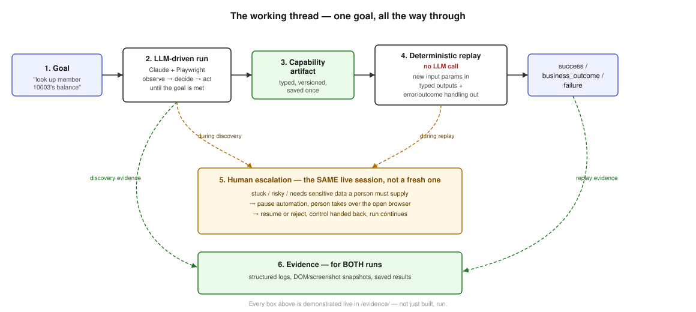

# REPORT

An AI reads an unfamiliar screen and figures out how to do a task on it — once. That successful
run becomes a small, typed, reusable recipe that runs on its own afterward, with no AI involved.
When it hits something it shouldn't handle alone — a risky action, or data it can't see — it stops
and hands control to a person on the exact same screen, then takes it back.

The thread itself — a real goal, a real LLM-driven run, a saved capability, a deterministic replay
with typed outputs and error handling, and a real human taking over a live session — runs
end-to-end in `/evidence/`, not just described below.

## 1. Architecture

Two halves: **discovery**, where the AI thinks, and **replay**, where it doesn't. Discovery runs an
observe → decide → act loop (Claude decides, Playwright acts) until the goal is met, then compiles
the run into a typed Capability. Replay reads that Capability and executes the same steps with
**no AI call at all** — new parameters in, a structured result out.

Both halves share the same guardrail check and the same browser session, deliberately, not as
separate copies — a duplicated safety check is a gap waiting to drift apart, and a shared browser
session is what makes the human handoff (§5) real instead of simulated.

**Single process, no queue or service split.** Discovery and replay run in one process against a
local browser and the filesystem — no broker, no separate services. At this scale that's not a
shortcut, it's the right call: a queue or service boundary would add real operational complexity
(state to serialize, a second failure mode to handle) for a workload that's one browser session at
a time. The Capability schema doesn't assume single-process, though — it's plain, storable JSON, so
splitting discovery and replay into separate services later wouldn't require touching the artifact
format at all.

**Why the DOM, not screenshots.** I have the AI read a cleaned-up **DOM** — the browser's structured
representation of the page — rather than a picture of it. The target app has no test IDs or
semantic labels, exactly like real legacy banking software. Reading the DOM lets me point at a
specific, nameable thing ("the field labeled Member Number") that resolves reliably later. A
screenshot tells the AI *where* something looks like a button, not *which* button it durably is —
and that distinction is what makes replay trustworthy instead of fragile. Screenshots of the actual
UI and a live guardrail stop are in `README.md` and `/evidence/`.

## 2. Artifact schema

A Capability is a recipe, not a recording — the raw discovery transcript is one-time-use; the
Capability is the reusable, typed version of it. Every one has: **inputs** (typed, auto-detected
when a typed value also appears in the goal text), **steps** (ordered, each pointing at an element
by a durable strategy — label, role, or text, never a coordinate), **outputs** (typed, with an
exact extraction target), and a **success condition**.

The decision I'd defend hardest: **I don't let the AI decide what an output is.** Early on I did,
and it captured the wrong thing (a label, not the value beside it). Now a person points at the
right value once, after one successful run, and that's locked into the recipe. The AI navigates a
screen better than it can be trusted to say precisely what the screen's answer is.

## 3. Determinism & error handling

Deterministic means: same recipe, same inputs, same steps, every time, with zero AI involvement —
enforced structurally, since replay's code never imports or calls the AI. Every outcome sorts into
one of three buckets: a **business outcome** ("no such member" — a real answer, not a crash), a
**quietly-handled hiccup** (one retry on a transient slow load), or a **hard failure** (reported
with the step, what was expected, and what was actually seen).

Two of these were found by breaking the system on purpose, not by foresight: two runs started in
the same second used to silently overwrite each other's saved results, and the keyword check
deciding "is this sensitive" could be evaded with full-width or invisible Unicode characters. Both
are fixed, both are pinned with a regression test.

## 4. Heterogeneity & multi-tenant

The recipe never knows it's talking to a browser — everything DOM-specific lives in one isolated
part of the code, and a Capability only ever says "click the thing labeled Retrieve," never a pixel
or a raw selector. Supporting a new surface (a desktop app, say) means writing one new adapter;
nothing about the recipe format changes.

Because a recipe finds things by label and role rather than exact appearance, it has a real shot at
working unmodified on a re-skinned instance of the same underlying vendor software. Where it can't
find something, replay reports a specific failure instead of clicking the wrong thing — the signal
a team needs to know a recipe has gone stale.

## 5. Escalation & handoff

Some actions an AI shouldn't take unsupervised — submitting a form that opens a real account,
typing a social security number. The system stops, explains what it wanted to do and why, and hands
the **same already-open browser window** to a person — not a fresh session. They can act directly on
the live page; the run resumes from wherever the screen actually ends up, not from a blind replay of
the original plan.

Tested for real, including the case that mattered most: a field re-verifying a member's SSN. The
system refuses to fabricate a value — it waits for a person to type the real one into the browser,
detects the page actually changed, and only then continues. I caught and fixed a bug in exactly
this flow where the log still showed the AI's made-up guess even after a human had overridden it;
it now correctly shows nothing, since the AI never knew the real value to begin with.

## 6. Safety

The agent can only act inside its configured app, checked before every action. Every action is
tiered — auto-run, needs a human yes, or never automatic at all, and that last tier really is
absolute. Sensitive-looking data is masked **before it reaches the AI**, not only in the logs
afterward, because the real risk is sending it to a third party at all, not just writing it down.

Two things found the hard way: masking an *empty* sensitive field the same as a filled one made the
AI think the field was done and skip it; and adversarial testing found the same sensitivity check
could be defeated with unusual Unicode. Both fixed and tested.

**Known limit:** the risk classifier is a keyword list, not real judgment — a proper version would
have a person review and sign off on each recipe's risk level once, the same trust model already
used for outputs (§2). Replay's saved result also still writes its raw input params unmasked — a
real gap, named rather than hidden.

## 7. Cuts

- Input detection only recognizes a value that literally appears in the goal text.
- Only the read-only flow was replayed end-to-end; the write flow was proven live via discovery and
  handoff, but not also recorded and replayed as its own capability.
- A second surface (desktop) and tenant-specific overrides are designed for, not built.
- The risk classifier is unreviewed; a couple of values (declared outputs, replay's raw params)
  stay unmasked where they probably shouldn't in production.
- A member number with a leading zero would silently lose it under current type handling.
- The allowlist-violation check is built and tested but never organically triggerable against this
  demo app, since nothing in it links off-site.

**Future work (What I'd do if I had more time):** a human-reviewed risk tier per recipe, a second surface to prove the abstraction, and
replay coverage for the write flow to match the read flow.

## 8. Stretch goals (two, as the brief allows)

Both extend already-tested systems rather than adding something disconnected, and both were
verified live. **Multi-run stability** (`--repeat N` on replay) ran the same recipe 3x on a success
case and 3x on a business-outcome case — identical results both times, real proof replay is actually
deterministic. **Confidence & approval gating**: every new recipe starts `draft`; an unattended
replay of a draft routes through the *same* escalation mechanism as a risky action, not a separate
flag, and a human explicitly promotes it to `approved` — verified live that the gate fires, a bare
resume doesn't silently promote the file, and an approved recipe then replays with no gate at all.
