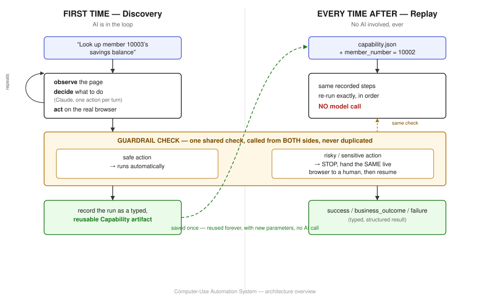

# REPORT

I'm going to explain this the way I'd explain it to someone standing next to me, not the way a
spec sheet would. Where I use a technical term I'll say what it means in plain words first, and
every decision below is one I can defend out loud — including the ones that turned out to be
wrong on the first try.

The short version of what I built: an AI reads an unfamiliar screen and figures out how to do a
task on it, the same way a new employee would. Once it succeeds, I don't make it re-figure that
out every time — I turn what it learned into a small, reusable recipe that runs on its own,
instantly, without the AI involved at all. And when the recipe hits something it genuinely
shouldn't handle alone — a risky action, or data it isn't allowed to see — it stops and hands the
keyboard to a person, on the exact same screen, then takes it back once they're done.

## 1. Architecture

I split the system into two halves that do very different jobs: **discovery**, where the AI is
actually thinking, and **replay**, where it isn't. Here's the shape of the whole thing:

The two halves share two things on purpose, drawn above as shared boxes rather than separate
copies: the **guardrail check** and the **browser itself**. If I'd written the safety check twice —
once for discovery, once for replay — the two copies would eventually drift apart, and that's
exactly the kind of gap a real bank couldn't accept. Sharing the actual browser session is what
makes the human handoff real: a person takes over the exact page the AI was looking at, not a
fresh, disconnected one.

- **Discovery** is the "figure it out" phase. Given a goal, the AI looks at the current screen,
  decides one small action — click this, type that — and does it, over and over, until the goal is
  met. I built this with Claude and Playwright (a tool that drives a real Chrome browser): Claude
  decides, Playwright acts.
- **Replay** is the "just do it again" phase. Once discovery succeeds, I compress everything it
  did into a typed, saved recipe (I call it a Capability — more on that in §2). Replay reads that
  recipe and carries it out step by step, with **no AI call at all** — same steps, new input
  values, instant, free, and predictable.

**Why text, not screenshots.** I chose to have the AI read a cleaned-up version of the page's
underlying markup, rather than look at a picture of the screen. The target application has no
labeled buttons or IDs for anything — it's exactly the kind of messy, old-style interface real
banking software actually has. Reading structure lets me point at a specific, nameable thing
("the field labeled Member Number") that a script can click reliably later. A screenshot would
tell the AI *where* something looks like a button, not *which* button it durably is — and that
distinction is what makes replay trustworthy instead of fragile.

## 2. Artifact schema

Here's the idea in one sentence: **a Capability is a recipe, not a recording.** The raw transcript
of a discovery run is messy and one-time-use — it's full of the AI's back-and-forth, the exact
numbers it happened to type, dead ends. A Capability is the cleaned-up, reusable version of that:
what to do, what it needs from you, and what it gives back.

Concretely, every Capability has:

- **Inputs** — the values you supply each time, typed (e.g. `member_number: int`). I detect these
  automatically: if a value the AI typed also shows up in the original goal text, I treat it as an
  input rather than baking it in as a fixed literal.
- **Steps** — the ordered actions, each pointing at an element by a durable strategy (its label,
  its role, its visible text) rather than a brittle click coordinate.
- **Outputs** — the typed values the capability hands back (e.g. `savings_balance: float`), with
  an exact instruction for where to read them from the final page.
- **A success condition** — one check that must hold true for the run to count as successful.

The one decision here I'd defend hardest: **I don't let the AI decide what counts as the output.**
Early on, I let it — the AI's own explanation of what it found sounded confident and specific, but
when I actually checked the saved recipe, it had captured the wrong thing (a label, not the number
next to it). So I changed it: a person looks at one successful run and points at exactly where the
answer lives, once, and that becomes locked into the recipe. The AI can find its way around a
screen far better than it can be trusted to say precisely what a screen's answer is.

## 3. Determinism & error handling

"Deterministic" just means: given the same recipe and the same inputs, replay does the exact same
thing every time, with zero randomness and zero AI involvement. I made that a structural guarantee,
not a promise — replay's code literally never imports or calls the AI at all, so there's no path by
which it could sneak in.

When something goes wrong during replay, I sort it into one of three honest buckets, because
lumping them together is how automation either cries wolf constantly or hides real problems:

1. **A real answer, just not the one you hoped for.** "This member doesn't exist" or "this account
   is restricted" isn't a bug — it's information the caller needs. I return it as a clean, named
   result, not an error.
2. **A hiccup, handled quietly.** If a screen is briefly slow to load, I retry once before giving
   up — enough to smooth over a real-world blip without hiding a genuine problem behind endless
   retries.
3. **A real failure**, reported with exactly what step it was on, what it expected to find, and
   what it actually saw — so anyone debugging it doesn't have to guess.

I want to be honest about how a couple of these got found: not by me thinking hard about edge
cases in advance, but by actually running the thing and watching it break. Two examples worth
naming, because they changed real code:

- Two automated runs started in the same second used to silently overwrite each other's saved
  results — I only caught this by deliberately firing several runs back-to-back and noticing one
  had vanished.
- The keyword check that decides "is this text sensitive/risky" originally just lowercased the
  text and compared it — which meant a sneaky variant using full-width or invisible characters
  could slip past it entirely. I found this by trying to break my own check on purpose.

Both are fixed now, with a test that pins the fix in place so they can't silently come back.

## 4. Heterogeneity & multi-tenant

The brief's real-world picture is hundreds of banks, each running around twenty apps, many of them
the *same underlying software* just re-skinned and re-labeled. I only built against one app, but I
designed with that picture in mind, not just the one screen in front of me.

The key idea: **the recipe never knows it's talking to a browser.** Everything that actually knows
about web pages — reading the screen, clicking things — lives in one small, isolated part of the
code. The Capability itself only ever says things like "click the thing labeled Retrieve," never
"click this exact pixel" or "run this exact bit of website code." That separation means teaching
the system a brand-new kind of interface later (a desktop app, for instance) is a matter of writing
one new small adapter — the recipes themselves, and everything that reads them, wouldn't need to
change at all.

For reuse across similar-but-different bank branding: because a recipe finds things by label and
role rather than exact appearance, it has a real shot at working unmodified on a re-skinned version
of the same underlying software. Where it genuinely can't find something, replay reports a clear,
specific failure rather than clicking the wrong thing by mistake — which is exactly the signal a
team would need to notice a recipe has gone stale and needs a quick re-recording, before it costs
anyone anything.

## 5. Escalation & handoff

Some things, I don't think an AI should ever just do on its own — submitting a form that opens a
real account, or typing in someone's social security number. For those, the system doesn't guess
and it doesn't push forward quietly. It **stops**, explains exactly what it wanted to do and why it
stopped, and hands the same already-open browser window to a person.

That last detail — *the same* window, not a fresh one — mattered enough that I built around it
specifically. A person can literally see and click around in the exact page the automation was
looking at, do the sensitive bit by hand if needed, and then tell the system to continue. The
system picks the story back up from wherever the screen actually is, rather than blindly repeating
whatever it originally planned to do — which matters, because by the time a person's done, the
right next step might genuinely be different from what was proposed a moment ago.

I tested this for real, more than once, including the case that worried me most: a field asking to
re-enter a member's SSN for verification. The system refuses to guess at that value — it can't see
it, so it won't fabricate something plausible-looking and type it in. It waits for a person to type
the real value directly into the browser, notices that the page actually changed, and only then
continues. I caught and fixed a real bug in exactly this flow, where the log used to still show the
AI's *made-up* guess even though a human had overridden it — now it correctly shows nothing at all,
because the AI never actually knew the real value in the first place.

## 6. Safety

A few rules the system never bends on:

- It can only ever act inside the one application it's configured for — nothing else, no
  exceptions, checked before every single action.
- Every action gets sorted into "fine to do automatically," "needs a yes from a person first," or
  "never automatic, full stop" — and that last category really does mean never, regardless of any
  setting.
- Sensitive-looking data (an SSN, a password) never reaches the AI in the first place. I mask it
  before the AI ever sees the page — not just afterward in the saved logs — because the real risk
  isn't just "did we write this down somewhere," it's "did we ever hand this to a third party at
  all."

A couple of honest, hard-won additions to that last point. First: the masking almost broke the
system in a subtler way than I expected — if an *empty* sensitive field got masked the same way a
*filled* one would, the AI reasonably assumed the field was already done and skipped it entirely.
I only found that by watching a real run skip a required field. Second: a later, deliberately
adversarial round of testing found that the keyword check behind both the safety rules and the
data-masking could be quietly defeated with unusual Unicode characters — the kind a person wouldn't
type by accident, but a system probing for weaknesses would try. Both are fixed, both are covered
by a test now, and I'd rather say so plainly than let a reviewer find either one first.

**Where I know this still falls short:** the "is this risky" check is a keyword list, not real
judgment — it will occasionally miss something it should catch, or flag something harmless. A
proper version would have each recipe's risk level reviewed and signed off by a person once, the
same way I already require for what a recipe reports back as its answer (§2). I'm also aware the
final saved replay result still writes out its raw input values without masking — a real gap I'm
naming rather than hiding.

## 7. Cuts

Being upfront about what I deliberately left out, and why, matters more to me than pretending this
is finished:

- The system currently only recognizes an input value as reusable if it literally appears, word
  for word, in the goal you typed. A more flexible version wouldn't need that.
- I only ran replay end-to-end against the simple, read-only flow (looking up a balance) — the
  more complex write flow (opening a new account) was proven live through discovery and the human
  handoff, but I didn't also record and replay it as its own recipe.
- Support for a second kind of application (a desktop program, say) and for tenant-specific
  overrides is designed for, in the sense that nothing in the architecture would block it — but
  neither is actually built.
- The "is this risky" check is a keyword list a person hasn't reviewed yet, not a vetted judgment.
- A couple of specific things stay unmasked today that probably shouldn't in a real deployment: a
  capability's own declared answers, and the raw inputs written into a replay's saved result.
- If a real member number legitimately started with a zero, my current handling would quietly
  drop it — I never handled that case.
- I looked for a case where the system should refuse to act because it's talking to the wrong
  website entirely — I built and tested that check, but couldn't actually trigger it for real
  against this particular demo app, since every link inside it stays on the same site by
  construction.

If I had more time, the first thing I'd build is a way for a person to review and sign off on a
recipe's risk level once, up front — the same trust model I already use for what a recipe reports
back. After that: a second kind of interface, to prove the design actually holds up outside a
browser, and a recorded, replayable version of the write flow to match the read flow's coverage.
